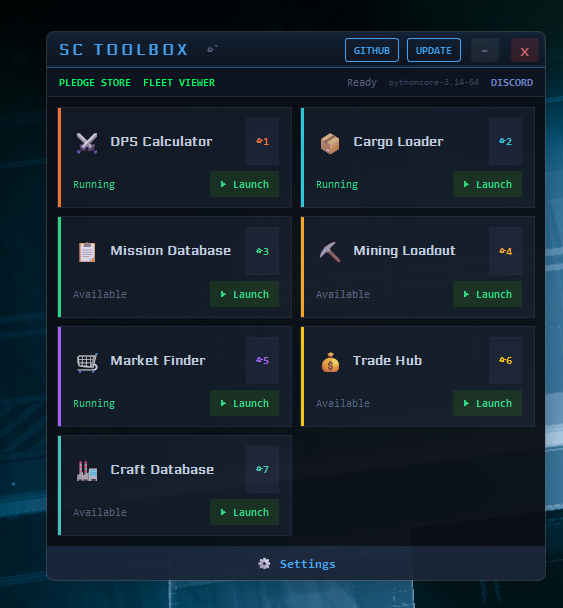
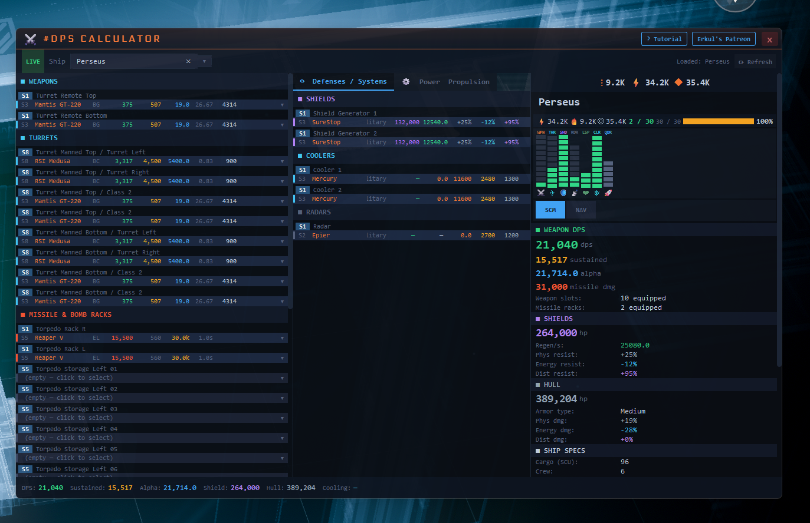
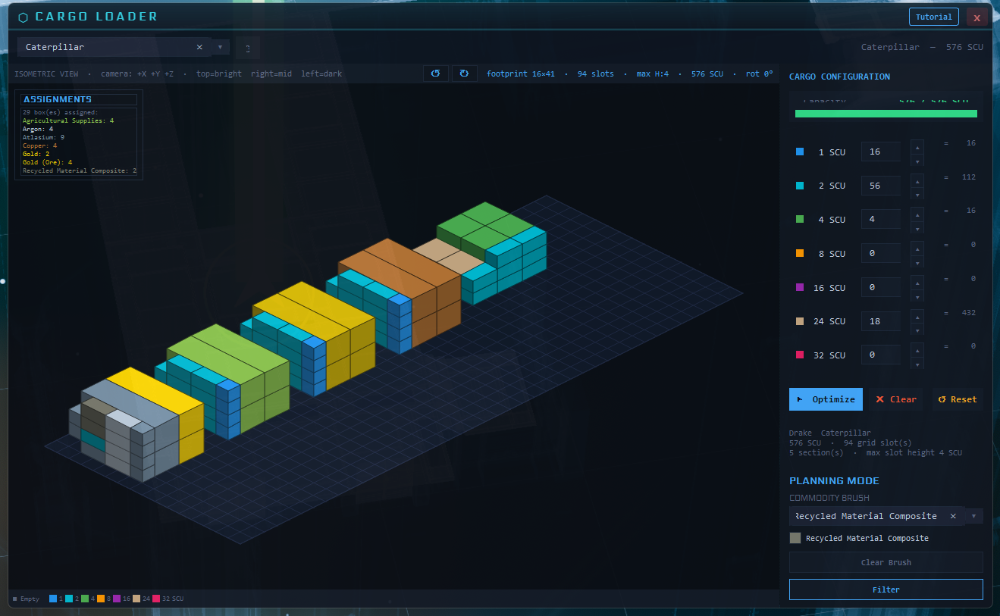
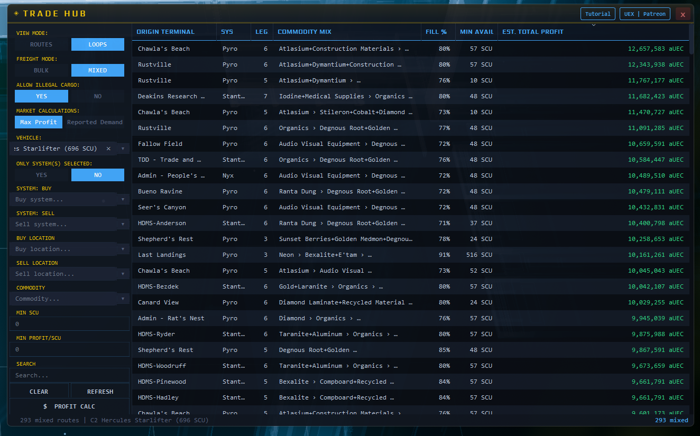
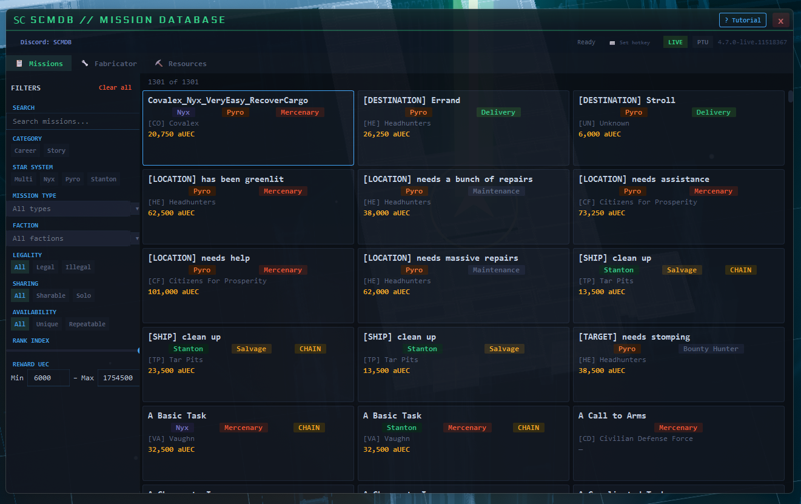
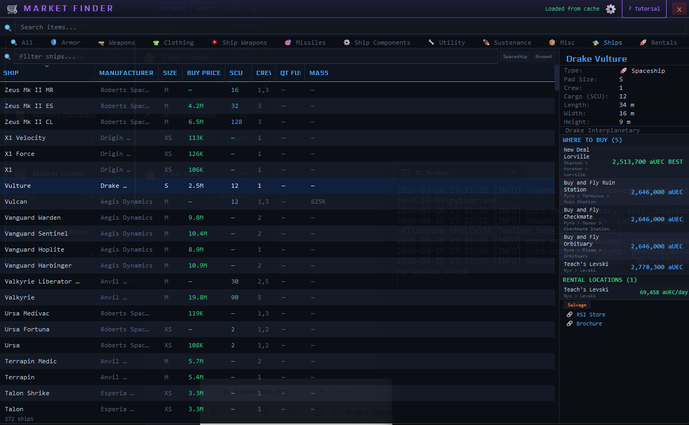
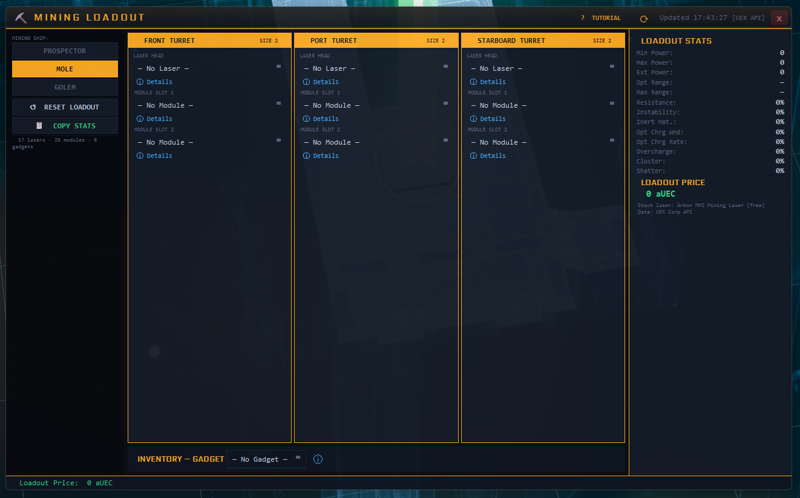
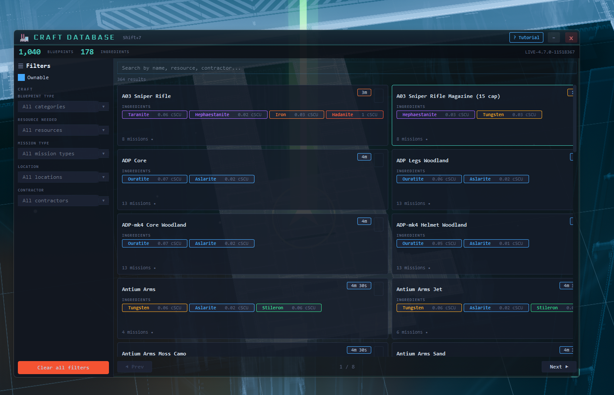

# SC Toolbox - Star Citizen Companion Suite

A unified desktop overlay for Star Citizen with 7 interactive gameplay tools. Pull up any tool instantly with global hotkeys while playing -- no alt-tabbing required.

Data is pulled live from community APIs ([erkul.games](https://erkul.games), [uexcorp.space](https://uexcorp.space), [scmdb.net](https://scmdb.net), [fleetyards.net](https://fleetyards.net)) and cached locally for speed.

  

---

## Tools

### DPS Calculator
Full ship loadout viewer and DPS calculator. Weapons, shields, power plants, coolers, quantum drives -- swap any component and see real-time DPS, alpha damage, and power draw.

---

### Cargo Loader
3D isometric cargo grid viewer and container optimizer. Visualize how containers stack in each bay and auto-calculate the best container mix to maximize SCU.

---

### Trade Hub
Trade route calculator with single-hop and multi-leg loop routes. Supports bulk and mixed freight modes. Filter by system, terminal, commodity, and ship capacity.

---

### Mission Database
Browse all in-game missions, crafting blueprints, and mining resource locations. Filter by system, type, faction, legality, and more. Supports LIVE and PTU data.

---

### Market Finder
Searchable catalog of every purchasable item in Star Citizen -- armor, weapons, ships, components, and more. See where to buy/sell and compare prices across terminals.

---

### Mining Loadout
Mining equipment optimizer for the Prospector, MOLE, and Golem. Configure lasers, modules, and gadgets with live stat breakdowns for power, resistance, and instability.

---

### Craft Database
Browse and filter all craftable items, resources, and components. Search by name, category, or material requirements.

---

## Installation

**Automatic (recommended):**
1. Double-click `INSTALL_AND_LAUNCH.bat`
2. Python is auto-installed if needed
3. The toolbox launches automatically

**Requirements:** Windows 10/11, Python 3.10+, internet connection.

## Default Hotkeys

| Key | Tool |
|-----|------|
| `Shift + ~` | Toggle Launcher |
| `Shift + 1` | DPS Calculator |
| `Shift + 2` | Cargo Loader |
| `Shift + 3` | Mission Database |
| `Shift + 4` | Mining Loadout |
| `Shift + 5` | Market Finder |
| `Shift + 6` | Trade Hub |
| `Shift + 7` | Craft Database |

All hotkeys are customizable in Settings.

## Data Sources & Credits

| Source | Data |
|--------|------|
| [erkul.games](https://erkul.games) | DPS calculator data, weapon stats ([Patreon](https://patreon.com/erkul)) |
| [uexcorp.space](https://uexcorp.space) | Market prices, trade routes, ship data, mining stats |
| [scmdb.net](https://scmdb.net) | Mission database, crafting blueprints, resource locations |
| [fleetyards.net](https://fleetyards.net) | Ship hardpoint data |

## Community

[Join the Discord](https://discord.gg/A7JDCxmC)
