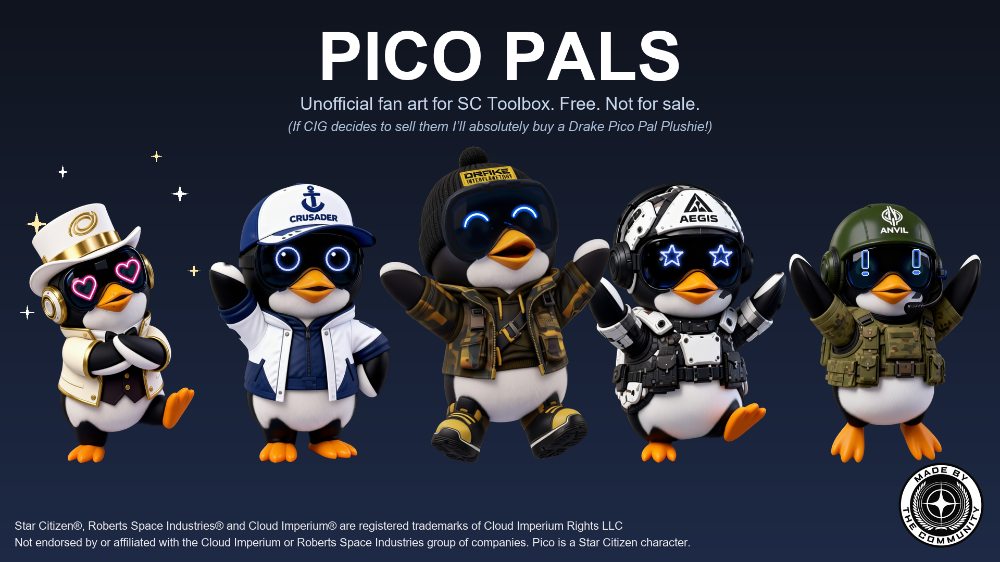
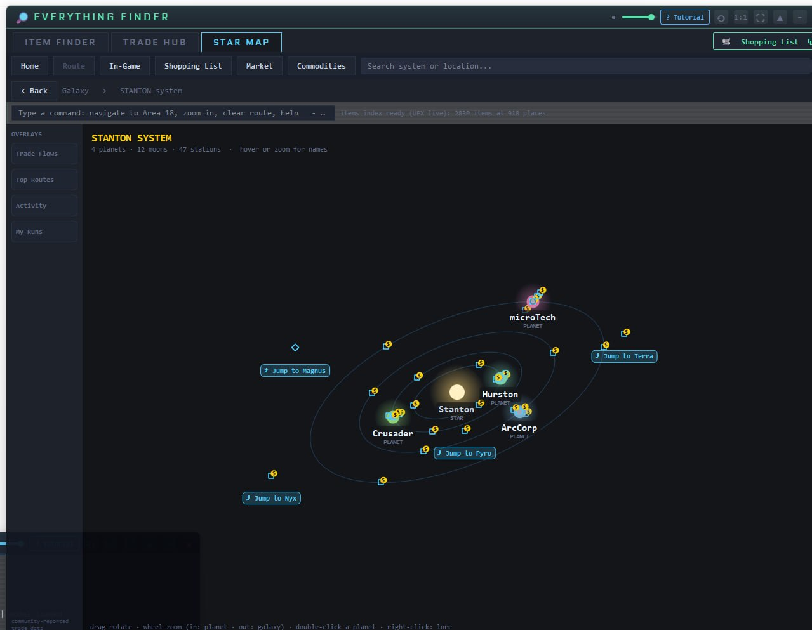
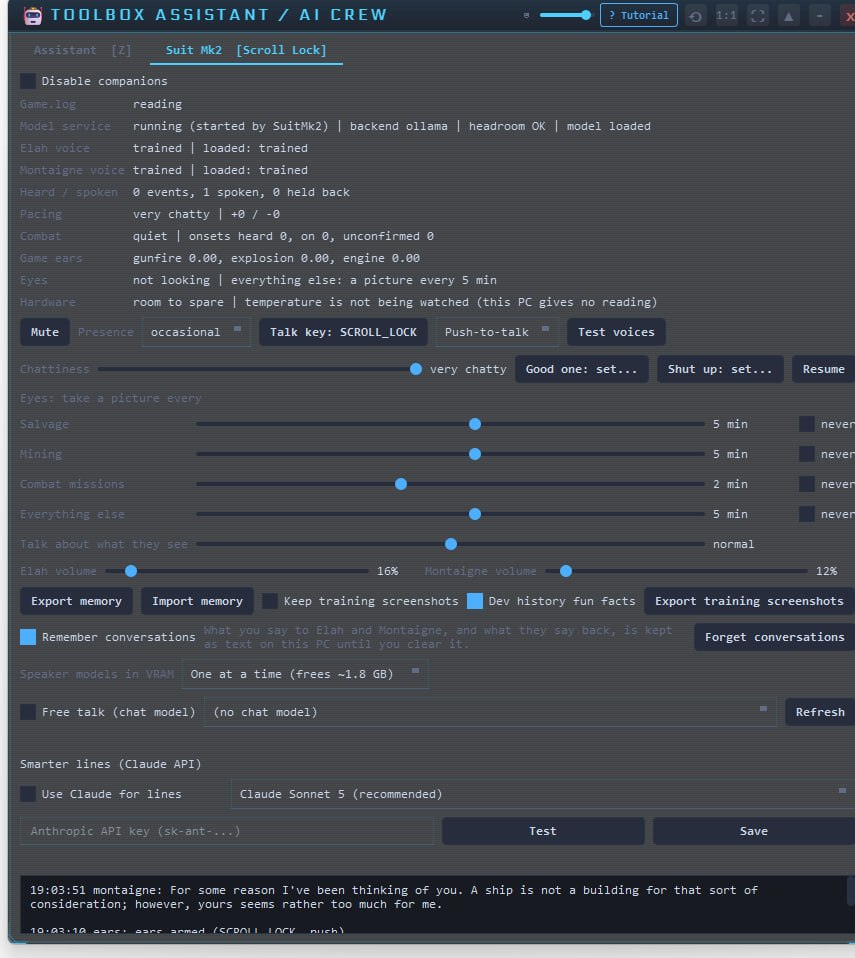
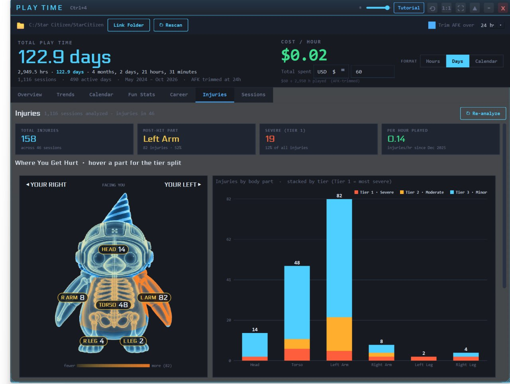
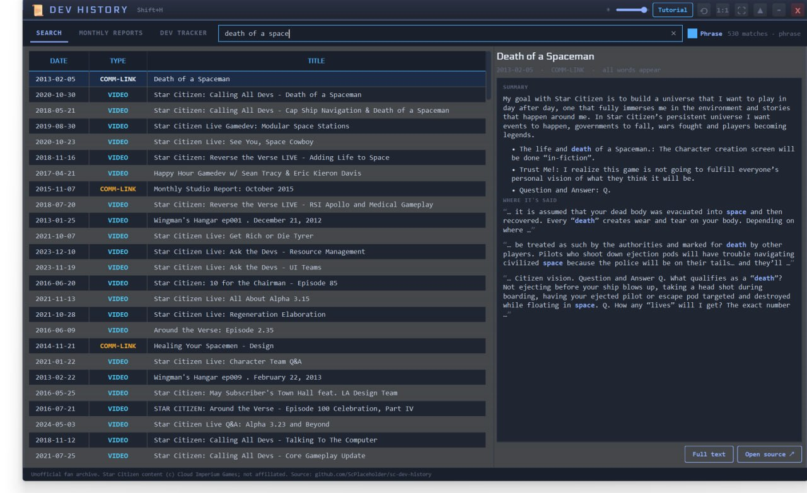

  

  <strong>We got featured by CIG!!! Thank you everyone! We wouldn't be here if it wasn't for your testing, feedback and support!!!</strong>

   
  <em>Pico Pals: Pico lives on your desktop, and his outfits download from inside the Toolbox</em>

  

<h1 align="center">SC Toolbox</h1>

  A free desktop overlay suite for <strong>Star Citizen</strong>: one launcher, a hotkey per tool, no alt-tab. 
  Loadouts, cargo, trade, mining, missions, a star map, two talking companions and a penguin.

  
  

SC Toolbox is an unofficial fan project. It is free, it is not for sale, and it takes no donations.

Most of the tools were designed and built for this project. A few started from, or stand on, tools the community had already made; those are named and credited in [Where the tools come from](#where-the-tools-come-from). How the more involved ones work is at the bottom, under [Boring Stuff](#boring-stuff).

---

## Download & Install

**[Download the latest installer](https://github.com/ScPlaceholder/SC-Toolbox-Beta-V2/releases/latest)**. No Python required; everything is bundled.

1. Download `SC_Toolbox_Setup_X.Y.Z.exe`
2. Run the installer (no admin rights needed; it installs per-user, and you can choose the folder)
3. Launch from the desktop shortcut or Start Menu
4. First launch: point it at your Star Citizen folder once (every tool shares the answer), then press **Ctrl + 0** to open the launcher and click a tile or use its hotkey

**Updating.** The toolbox checks GitHub each time it starts, downloads only what changed, and applies it the next time you launch. The **UPDATE** button in the launcher does the same job on demand by fetching and running the new installer. Your settings live in your user folder, outside the install folder, so an update does not reset them.

---

## What's New in v3.0.0

- **Pico Pals.** Pico, a small penguin, lives on your desktop and reacts to what happens in your game: he holds the weapon you draw, eats what you eat, and has opinions about your quantum jumps. Nineteen outfits, one per ship maker, downloaded as a pack the first time you pick one.
- **Toolbox Assistant / AI Crew.** The Assistant and Suit Mk2 now share one window with a tab each. Ask the Assistant about trade routes, prices, cargo, missions and loadouts by voice or text; it looks the answer up in the other tools. Each has its own push-to-talk key, and the key you hold decides who hears you.
- **Suit Mk2.** Two companions, Elah in your suit and Montaigne in your ship, comment on your session and answer questions, with a conversation memory you can clear, optional free talk, and an off switch for people who want none of it.
- **Everything Finder.** Item Finder, Trade Hub and the Star Map in one window, with one shared shopping list. Each tab loads the first time you open it.
- **Dev History.** Search what the developers have said about Star Citizen: video transcripts, official posts, Monthly Reports and the dev tracker, with a link to the original.
- **PlayTime.** An Injuries tab with a body diagram, a calendar, and a cost-per-hour figure for the brave.
- **Cargo Loader.** Ship grids are now built from the community's published game data ([scunpacked-data](https://github.com/StarCitizenWiki/scunpacked-data)). Drag-and-drop placement, solid ship items (ore pods, missiles, components), personal crates, and an Optimize that packs around whatever is already in the hold.
- **DPS Calculator and Craft Database** now read the community's published game data (scunpacked-data), pinned to one known commit. The DPS Calculator gains a power allocator and IR/EM signatures.
- **Mining.** Crafted lasers in Mining Loadout carry through to Mining Signals. Mining Signals gains Dev Mode, which lets you train the scanner on your own monitor.
- **A tutorial in every tool**, from "? Tutorial" in its title bar.
- **Quality of life.** One button in Settings puts Pico Pals and Battle Buddy back in the middle of the screen. Battle Buddy now answers the launcher instantly (show and hide used to take ten seconds). Windows can no longer open off-screen. Settings survive updates. The installer lets you choose where to install. The UI is fully translated into German.

Earlier: What's New in v2.3.1

- **Mining Signals now scans correctly on machines other than the developer's.** HUD panels were normalised against the wrong reference height and only ever rescaled upward. Now calibrated to the native height and normalised in both directions.
- **Local signature OCR fallback**: the scanner degrades gracefully when the primary reader is unavailable. (Thanks [@garrett-williams](https://github.com/garrett-williams).)
- **The installer reports the version it is actually installing.**
- **Installer privacy**: the build no longer embeds the build machine's Windows username.

---

## Tools

| Hotkey | Tool | What it does | Data source |
|--------|------|--------------|-------------|
| Shift+1 | **DPS Calculator** ² | Pick a ship, swap weapons, shields and components, and see damage, power use and signatures before you buy the parts | StarCitizenWiki/scunpacked-data (calculator lineage: erkul.games), fleetyards.net, uexcorp.space |
| Shift+2 | **Cargo Loader** ³ | See a ship's cargo hold in isometric 3D and work out how to pack containers, commodities and loose items | StarCitizenWiki/scunpacked-data (sc-cargo.space fallback) |
| Shift+3 | **Mission / Craft DB** ³ | Browse missions and rewards, crafting blueprints and mining locations; keeps track of the blueprints you own | scmdb.net |
| Shift+4 | **Mining Loadout** ² | Fit a mining ship with lasers, modules and gadgets and see what each choice does to its stats and cost | uexcorp.space |
| Shift+8 | **Battle Buddy** ¹ | An on-screen bar of the weapons you carry, spare magazines, pens and grenades, kept current from the game's log | Star Citizen game log |
| Shift+0 | **Mouse Blocker** ¹ | Covers your main screen and catches mouse clicks so they do not reach the game by accident | none |
| Shift+H | **Dev History** ¹ | Search what the developers have said: video transcripts, comm-links, Monthly Reports and the dev tracker | github.com/ScPlaceholder/sc-dev-history |
| Ctrl+1 | **Mining Signals** ¹ ² | Reads your mining scan from the screen, says what the rock holds and whether your ship (or your fleet) can break it; tracks refinery orders and your mining crew | Screen capture, scmdb.net, a community signal spreadsheet |
| Ctrl+3 | **Toolbox Assistant / AI Crew** ¹ | Ask out loud about trade routes, prices, cargo, missions and loadouts; it looks the answer up in the other tools. Second tab: Suit Mk2 | the other tools' data |
| Ctrl+2 | **Suit Mk2** ¹ (a tab of the Assistant) | Two AI companions, Elah in your suit and Montaigne in your ship, talk about what happens in your game and answer questions | Star Citizen game log, screen, game audio |
| Ctrl+4 | **PlayTime** ¹ | Adds up how long you have played, read from the game's logs: sessions, trends, a calendar, injuries and fun stats | Star Citizen game logs |
| Ctrl+6 | **Everything Finder** ¹ | Item Finder, Trade Hub and the Star Map in one window, with one shared shopping list | uexcorp.space, bundled map data |
| Ctrl+7 | **Pico Pals** ¹ | Pico, a small penguin on your desktop who reacts to your game. Drag him anywhere; right-click to change how he looks | Star Citizen game log |

¹ built for this project · ² part of it started from a community tool · ³ built here on a community site's data. Details just below.

Four tools no longer have a launcher tile of their own but keep their hotkeys: **Item Finder** ³ (Shift+5), **Trade Hub** ³ (Shift+6), **Craft Database** ³ (Shift+7) and the standalone **Star Map** ¹ (Ctrl+5). Item Finder, Trade Hub and the Star Map are also the three tabs of the Everything Finder.

Press **Ctrl + 0** to toggle the launcher window. Hover a tile to see what the tool does and its hotkey.

Default hotkeys are a modifier plus a number (Dev History's Shift+H is the one exception), so they should not fire while you type. Shift+number and Ctrl+number are unbound in Star Citizen's default keyboard profile. If two tools end up on the same combination, the launcher keeps the first, leaves the other unbound and says so in its status line. Rebind any of them in Settings. The two push-to-talk keys default to **Pause** (Assistant) and **Scroll Lock** (Suit Mk2) and are changed on each tab.

### Where the tools come from

**Built for this project.** Mining Signals' screen reader (the SC_OCR engine) and its mining roster, Suit Mk2, the Toolbox Assistant, Pico Pals, Battle Buddy, PlayTime, Dev History, the Star Map, the Everything Finder, Mouse Blocker, and the launcher, installer and updater they all run in.

**Started from a community tool, with additions.**

- **DPS Calculator** follows [erkul.games](https://erkul.games), the community's loadout calculator, and was first built on its data. This version runs as an in-game overlay, now computes from the community's published game data ([scunpacked-data](https://github.com/StarCitizenWiki/scunpacked-data)) instead of erkul's servers, keeps erkul's power-allocation behaviour, shows where to buy each component and for how much, and answers loadout questions through the Assistant.
- **Mining Signals' break check** is a Python port of [Mort13's BreakabilityChart](https://mort13.github.io/BreakabilityChart/) math, using the community-standard mass coefficient also used by [Regolith](https://regolith.rocks). This version feeds it from the live screen read as well as typed numbers, and extends it to a fleet: which ships, which crew, and which gadget break this rock (see [Mining Signals: fleet allocation](#mining-signals-fleet-allocation)). Its charge-time estimate is modelled on [scmdb.net](https://scmdb.net)'s Mining Solver.
- **Mining Loadout** mirrors the [Regolith](https://regolith.rocks) loadout calculator, on live [uexcorp.space](https://uexcorp.space) item data. This version runs as an overlay, adds crafted lasers, shows where to buy each part, and saves loadouts that Mining Signals' break check reads directly.

**Built here on a community site's data.** Cargo Loader (first on [sc-cargo.space](https://sc-cargo.space)'s grids, now on scunpacked-data's), Mission / Craft DB ([scmdb.net](https://scmdb.net)), Craft Database (scunpacked-data's blueprints, joined to scmdb.net's missions), and Item Finder and Trade Hub ([uexcorp.space](https://uexcorp.space)). The interfaces, the packing, route and loadout math, and the way they talk to each other are this project's; the data, and the idea that such a tool should exist, are the community's. None of these would work without the sites behind them.

### UI scale

**Settings → Tools → UI Scale** enlarges every window for a high-DPI monitor; the toolbox restarts itself to apply it. The list only offers the scales your monitor can still show the Settings window at, and the Settings window is clamped to the screen so its Apply button can never end up outside it. If a window ever does open partly off-screen, closing Settings with its [x] saves the current values, exactly like Apply. Only Cancel discards.

---

## Screenshots

   
  <em>The launcher: click a tile or use the global hotkey</em>

   
  <em>Everything Finder, Star Map tab: the Stanton system, with shops marked, jump points labelled and a command box that takes "navigate to Area 18"</em>

   
  <em>Toolbox Assistant / AI Crew, Suit Mk2 tab: status of the companions' log reader, voices, eyes and game ears, with the dials for how much they talk and how often they look</em>

   
  <em>PlayTime, Injuries tab: where you get hurt, by body part and severity, on an X-ray Pico</em>

   
  <em>Dev History: a phrase search across years of developer videos and posts, with the lines where it was said and a link to the source</em>

   
  <em>Battle Buddy: equipped weapons, spare magazines and consumables, worked out live from the game log</em>

   
  <em>Mining Signals: the scan read off your ship's HUD and matched to what the rock could be</em>

   
  <em>DPS Calculator: ship loadout with weapon DPS, shields, hull and power</em>

   
  <em>Cargo Loader: an isometric cargo grid with containers placed and commodities assigned</em>

   
  <em>Mission / Craft DB: missions by system, faction and type</em>

   
  <em>Mining Loadout: lasers, modules and gadgets compared for a mining ship</em>

   
  <em>Trade Hub: routes ranked for your ship and budget</em>

---

## Requirements

- **Windows 10 or 11 (64-bit).**
- **About 5 GB of disk.** The installer refuses a drive with less than 4 GB free.
- **Internet** for prices, missions and updates. Several tools keep working from their caches when a data source is down.
- **Star Citizen in Borderless Windowed mode** for anything that reads the screen (Mining Signals in particular).
- **A microphone** only if you want to talk to the Assistant or the companions. Typing works too. The first time you use voice, the speech model downloads itself (a few hundred MB, once).
- **For Suit Mk2's companions:** a one-time setup inside the tool, behind one button ("Set up Elah and Montaigne (about 1.9 GB)"). It uses [Ollama](https://ollama.com) as the local model runtime and offers to install it if you do not have one. A graphics card with memory to spare helps; the companions unload or go quiet when the game needs the card. Optional extras, both off by default: a local vision model so they can look at the screen, and a chat model for free talk.
- **Nothing extra for the Assistant.** With no language model reachable it still answers, in plain sentences built from the tools' own results.

Everything the companions do runs on your PC unless you choose otherwise. The two "otherwise" options are yours to turn on with your own key: pointing the Assistant at an OpenAI-compatible or Anthropic endpoint, and wording the companions' lines with the Claude API.

**Your own voices.** On the Suit Mk2 tab, under the volume sliders, "Elah voice" and "Montaigne voice" each offer Built-in, every voice file you have put in `%USERPROFILE%\.sctoolbox\suitmk2\voices` (make the folder if it is not there), and Browse… to pick a file from anywhere. A voice file must be a Piper `.onnx` with its `.onnx.json` beside it. The choice is used from the next line, with no restart, and Test voices lets you hear it. If a file cannot be used, that companion keeps its built-in voice and the tab says which file and what was wrong. The Assistant uses the same file when it speaks as Elah or Montaigne. When it speaks with the Windows voice instead, its Settings… has a "Windows voice" list of the voices installed on your PC.

---

## Features

- **Always-on-top overlay** that stays visible over Star Citizen
- **Global hotkeys**: toggle any tool without alt-tabbing, rebind all of them in Settings
- **Live data**: prices, loadouts and missions pulled from community APIs, with local caching and background refresh
- **One shared game folder**: tell the launcher where Star Citizen is once and every tool uses it
- **A tutorial in every tool**
- **English and German**
- **WingmanAI integration** (optional): the toolbox also runs as a WingmanAI skill

---

## Manual Install (Advanced)

If you prefer to run from source instead of the installer:

1. Install Python 3.10+ (the installer bundles 3.14)
2. Run `INSTALL_AND_LAUNCH.bat` (installs dependencies and launches)
3. Or manually: `pip install -r requirements.txt` then `python skill_launcher.py`

Suit Mk2's two voices and character models, and Mining Signals' bundled Tesseract and PaddleOCR runtime, are staged by the installer build and are not in the repository. From source, the companions fall back to stock voices and Mining Signals to whatever OCR engines it can find.

---

## Data Sources & Credits

**Data**

- [StarCitizenWiki/scunpacked-data](https://github.com/StarCitizenWiki/scunpacked-data): the community's published per-patch game data: ships, weapons, components, cargo grids, blueprints, star-map positions
- [erkul.games](https://erkul.games): the DPS calculator's lineage and original data source ([Patreon](https://patreon.com/erkul))
- [uexcorp.space](https://uexcorp.space): market prices, trade routes, terminal distances, ship data, mining equipment
- [scmdb.net](https://scmdb.net): mission database, crafting blueprints, mining resources and locations
- [fleetyards.net](https://fleetyards.net): ship hardpoint data
- [sc-cargo.space](https://sc-cargo.space): cargo grid layouts
- [api.star-citizen.wiki](https://api.star-citizen.wiki) and [starcitizen.tools](https://starcitizen.tools): star systems, jump points and the lore shown on the Star Map
- [The Galactapedia](https://robertsspaceindustries.com/galactapedia), Cloud Imperium Games' own lore encyclopedia, read through api.star-citizen.wiki: the one-sentence excerpts Elah quotes about places, each kept with a link to its article

**About "datamined".** Wherever this page says a tool reads datamined game data, it means the JSON files the community project [StarCitizenWiki/scunpacked-data](https://github.com/StarCitizenWiki/scunpacked-data) publishes on GitHub. Ship, item and blueprint files are downloaded from one pinned commit of that repository; the cargo grids and star-map positions that ship with the Toolbox were converted from the same repository ahead of time. No tool in the Toolbox opens, unpacks or reads Star Citizen's archive files to get ship, weapon, component, cargo-grid or blueprint data.

**Community tools this project learned from or ports**

- [Mort13's BreakabilityChart](https://mort13.github.io/BreakabilityChart/): the breakability formulas behind Mining Signals' break check
- [Regolith](https://regolith.rocks): the loadout calculator Mining Loadout mirrors, and the community-standard mass coefficient
- scmdb.net's Mining Solver: the charge-time model
- The community mining-signal spreadsheet: the table Mining Signals matches a signature against
- The SC-Datarunner-UEX project: the Tesseract model fine-tuned on the game's HUD font, used as Mining Signals' fallback reader

**Open-source software inside the installer**

PySide6 (Qt), ONNX Runtime, Tesseract OCR, PaddleOCR, faster-whisper, Piper, YAMNet (Google's AudioSet model, ONNX build by Qualcomm AI Hub), Qwen2.5 and Gemma via Ollama, and Velopack for updates.

---

## Community

- [Discord](https://discord.gg/D3hqGU5hNt): bug reports, feedback and discussion

---

## Boring Stuff

This section is for people who want to know how the tools work underneath. You do not need any of it to use them.

Functionally, SC Toolbox combines custom OCR and computer vision, mining coordination and fleet planning, live trade and commodity analysis, navigation and starmap tooling, speech recognition and voice-command routing, game-log interpretation, HUD/overlay systems, interactive AI personas, and animated game-aware companions within a single Star Citizen utility suite.

Two constraints shaped almost every decision below. First, all of it runs beside a game that wants the whole machine, so anything heavy has to be cheap, optional, or willing to step aside. Second, the game offers no API. Everything the toolbox knows about your session comes from three places you can already see or hear yourself: the game's log file, the screen, and the game's audio. Nothing reads or writes game memory, and nothing sends input to the game except one route-setting macro that asks first.

### How it fits together

**One process per tool.** The launcher discovers tools by scanning for `skill.json` files and starts each one as its own Python process. It talks to a running tool through a small command file in the temp folder: one JSON object per line (`show`, `hide`, `toggle`, `quit`, `reset_position`), appended under a file lock by the launcher and polled a few times a second by the tool. A tool that crashes takes nothing else down; the launcher notices the exit code and shows the tool's own crash log. Global hotkeys are queued and handled on the GUI thread, and two tools that claim the same key are detected instead of the last one silently winning.

**Settings live outside the install folder.** The updater replaces the install folder wholesale, so anything saved beside the code would be lost on every release. Settings, caches, conversation memory and downloaded data live under the user's home folder instead, with a one-time migration that carries an older install's settings across.

**Game data comes from one public repository, pinned.** Ship, weapon, component, cargo-grid and blueprint data is not unpacked from the game by the Toolbox. It is downloaded from the community repository StarCitizenWiki/scunpacked-data, through one adapter that asks for a specific commit, keeps the files in the user folder, and carries SHA-256 hashes of the files to check them against. A game patch cannot silently change the numbers under a tool; moving to a newer commit is a deliberate step.

**The build refuses to ship a broken installer.** Every tool is started from the staged copy, with an empty home folder and no network, before a package is made. The detail is in [Build, updater and release safety](#build-updater-and-release-safety).

**Two small static sites.** Pico's outfits download from a pack site and are verified against a manifest. The companions' eyes have a reference site of ship-footage fingerprints, which the toolbox can read but does not yet use to recognise anything.

That is the shell the tools run inside. The harder problem is getting useful information into them: Star Citizen exposes no gameplay API, so the Toolbox has to reconstruct what it knows from the same things the player can see and hear.

### Observing the game

#### Game log interpretation

**The problem.** Star Citizen writes a running log of what the client is doing. It is not an API: it is diagnostic text that repeats itself, changes between patches, and leaves out a great deal. Six tools read it, each for a different purpose, and each has to be honest about what the log cannot tell it.

**Shared and separate.** The one shared piece is the answer to "where is the game installed", asked once by the launcher and stored outside the install folder; before that, five tools each had their own detector. The readers are deliberately separate, because the tools want different things:

- **Battle Buddy** tails the log four times a second and tracks equipment by the game's entity ids: an item arriving in a port, leaving one, or moving to your hand. A magazine that moves from a spare slot into a weapon is a reload. Several pens vanishing at once is an armour swap, not five injections. It starts by searching backwards for the start of the current session and replaying it, so opening it mid-session still shows the right loadout. It cannot know how many rounds are left in a magazine, because the log never says.
- **PlayTime** never tails. Each log file is one session; a fast pass reads only the first and last timestamps of every current and archived log, and a deeper pass reads contents for the statistics. Both passes cache per file by size and modification time, so a rescan only reads what is new.
- **Suit Mk2** has the richest parser, and much of its care goes into not counting things twice. Echoed notification lines are skipped, a session start is not counted twice, and an incapacitation is debounced to one per incident.
- **Pico Pals** reuses Suit Mk2's parser instead of writing a third, and checks when it loads that the parser still produces the event names it expects.
- **Mining Signals** and the **Mission DB** read the log for finished refinery orders and owned blueprints.

**Where the log is silent**, the tools say so or use another sense. The log records a weapon going into a slot but never one being drawn, so Suit Mk2 confirms combat from game audio. The kill feed was removed from the log, so PlayTime does not show kills. A log that has been quiet for fifteen minutes makes Pico look confused, not calm.

#### SC_OCR: reading the mining HUD

**The problem.** A mining scan puts three numbers on the HUD (mass, resistance, instability) and a signature number on the scanner. The game will not tell you what they are, so Mining Signals reads them off the screen about once a second. The font is thin, glows, shifts colour at its edges, and its 5 and 6 differ by one stroke; the panel bobs by a couple of pixels; the background can be black space or a bright moon. General-purpose OCR is trained on documents and does poorly here, and the reads have to cost almost nothing because the game is using the CPU.

**How it works.** The pipeline (`SC_OCR`) treats finding the text and reading the text as separate jobs.

- **Find the panel.** Fixed features of the HUD are located by template matching (normalised cross-correlation): the "SCAN RESULTS" title for the rock panel, the location-pin icon for the signature. The panel is rescaled to one reference height first, in both directions, so the same templates work at any resolution or HUD scale.
- **Remember where it was.** Once the rows are found, small fingerprints of the pixels under each label are kept, and later frames check the fingerprints instead of searching again. A full search runs only when the pixels change, or every twentieth frame regardless.
- **Read with several small models and vote.** A sequence model reads the whole value strip in one pass. Separately, the strip is cut into glyphs and each glyph is classified by small convolutional networks (28×28 inputs): a greyscale one, a colour one, and a twin of each trained on inverted pixels. The twins see opposite polarities, so they rarely make the same mistake; agreement between a greyscale and a colour reader counts for more than agreement between two of a kind. Tesseract, with a model fine-tuned for this font, is the slower fallback, and a set of font templates breaks ties. All of the networks run on the CPU through ONNX Runtime.
- **Do not believe one frame.** A value is shown only after it repeats across recent frames. A value that has been stable gets locked, with a fingerprint of its pixels, and is not re-read until the pixels change. For signatures, the list of values that actually exist in the game is known, so a read that matches a real value beats a near miss that does not.

**The pieces around it.** An older three-engine path (two Tesseract passes plus PaddleOCR) is still there behind a switch. PaddleOCR runs in its own bundled Python 3.13 process, because it has no build for the Python the app runs on, and is spoken to over a pipe with its CPU threads capped. **Dev Mode** lets a user capture panels on their own monitor, confirm the labels, train a candidate model, and activate it only if it scores strictly better on a held-out set; the shipped models are never overwritten and reverting is one step.

**Known limit.** The remaining errors are systematic, not random. Rescaling softens glyph edges, and a few shapes (5 against 6, thin 1s, decimal points) are still misread on the hardest panels. Voting across frames cannot fix an error that is the same in every frame.

Two more senses belong to the companions and are described under [Suit Mk2](#suit-mk2-the-ai-companions): they listen to the game's own audio to confirm combat, and they look at the screen when the log is not enough.

Those readers turn an opaque game session into structured facts. Most of the Toolbox after this point is deliberately less clever: once the facts are known, ordinary deterministic code does the work.

### Turning data into answers

#### Battle Buddy and PlayTime

**The problem.** The game keeps no play-time counter you can read, no injury history and no record of what you are carrying. The log holds enough to rebuild all three.

**PlayTime.** Every log file the game has kept is one session, so total play time is a sum over files and needs no running tracker. A fast pass reads only the first and last timestamp of each file; a deep pass, started the first time a tab needs it, reads the contents for the statistics. Both cache per file by size and modification time. From the session list come the trends, a clickable calendar (sessions that cross midnight are split by one shared routine, so the calendar and the charts cannot disagree), and a cost-per-hour figure, which is the amount you type in divided by the hours counted. An optional cap trims any session longer than a chosen number of hours, for nights the game was left running; the untrimmed list is kept beside it.

**Injuries** come from the HUD notification the game writes when you are hurt: body part and tier. The game echoes each notification several times, so only the line that adds it is counted; counting every mention inflates the total about five-fold. Injuries per hour counts only sessions since the first logged injury, so years of logs from before the game wrote these lines do not dilute it.

**Battle Buddy** is covered under [Game log interpretation](#game-log-interpretation): it is the one telemetry tool that runs live.

**Known limits.** History ends at the oldest log the game has kept. Payouts are not in the log, so the Career tab shows counts, not earnings.

#### Mining Signals: fleet allocation

**The problem.** Whether a rock can be broken depends on its mass and resistance against the combined power of the lasers pointed at it. For one ship that is arithmetic, and the arithmetic is the community's (see the credits). For a mining group with several ships, multi-crew turrets, limited gadgets and limited module charges, the useful question is a different one: what is the least disruptive set of ships and people that can break this rock?

**How it works.** The Mining Roster is a node graph you build by dragging: foreman, teams, ships, crew. The calculator is pure math with no knowledge of the UI or of where its data came from. When the scanner reads a rock, the calculator widens its search in steps and stops at the first answer:

1. your ship alone, trying passive stats first, then active modules, then gadgets;
2. your whole team;
3. your team plus one other team from the same cluster;
4. your team plus one team from another cluster;
5. your whole cluster together;
6. other clusters added one at a time.

Within a step it enumerates every combination of lasers, fewest first. Past twelve turrets, where that would mean thousands of combinations per scan, it switches to a greedy strongest-first pass. For a fleet it reports two answers side by side, fewest players and fewest ships, and ranks ties by a stability score that prefers power headroom over stacked resistance modifiers.

**Crew is part of the model.** A turret with nobody in its seat does not count. Players you have marked as reassignable can be pulled to fill an empty turret, strongest turret first, one move per player per rock, and the ship a miner was pulled from is removed from that rock's calculation so its lasers are not counted twice.

**Also estimated:** the minimum throttle that overcomes the rock's decay, and the time to reach the optimal window. Those constants were derived from a small number of observations and are labelled as such in the code.

#### Trade Hub

**The problem.** Turn community-reported prices into runs worth flying, for your ship and your budget, without pretending the data is better than it is.

**How it works.** Trade Hub fetches three things from UEX (every commodity price, the terminals, the commodities) and builds the routes itself, pairing each place a commodity can be bought with each place it sells for more. It keeps the best five thousand pairs and refreshes every five minutes. Fetching runs on background threads and results are handed to the window through Qt signals.

What a route is worth depends on what you can actually move. The load is the smallest of your ship's capacity, the stock at the origin and the demand at the destination; profit is that load times the margin. A "Max Profit" switch ignores reported demand, for players who do not trust it. A starting-investment filter removes routes you cannot afford to fill.

On top of the single hops:

- **Loops** chain trades greedily, selling at each stop and buying for the next leg, without revisiting a terminal except to come home.
- **Mixed freight** handles the case where no single commodity fills the hold: it takes a high-margin commodity in short supply as an anchor, fills the rest of the bay with other goods going to the same place, chains those loads, and applies a small penalty per extra stop so a seven-stop route has to earn its complexity.
- **Basket** answers the opposite question, "I need these things, where do I go": a greedy set-cover that picks the stop covering the most missing items, nearest first, and offers up to five plans (fewest stops, shortest trip, best price).

Distances between terminals come from UEX and are cached on disk. The other views (a star map the route can be drawn on, a heatmap, a commodity board, a personal log of completed and failed runs) read the same route table. The shared shopping list and the Assistant both use this engine instead of reimplementing it.

**Known limits.** Prices are reports from other players and can be stale; the Activity overlay shows how fresh each one is. The travel-time estimate uses one fixed quantum speed whichever ship you chose, and says so in the tutorial. If a refresh fails, the route table empties until the next one succeeds.

#### Cargo Loader

**The problem.** Draw any ship's cargo hold, let the user fill it by hand or automatically, and never show a layout the game would not allow.

**Grids from published game data.** Ship grids were first read from a community site. They are now converted from the ship file that StarCitizenWiki/scunpacked-data publishes (the Toolbox does not unpack the game itself), by an offline converter that does not assume which file axis is which: it scores all six axis mappings against the previously known grids and picks the winner (63 exact shape matches against 23 for the runner-up). The result covers 144 ships. The original source is still selectable, the pre-conversion grids are kept as a baseline for diffing, and ships that file lacks are carried over instead of dropped.

**One set of placement rules.** The hold is a voxel grid of 1.25 m cells. A container placed by hand passes seven ordered rules: snap to the grid, snap flush to a neighbour when close, stay inside a grid, respect the grid's container size limits, stay under the ceiling, overlap nothing, and rest on something. Ship items (ore pods, missiles, components) are solid objects with footprints taken from the data.

**Optimize** fills each bay largest container first, trying every rotation at every free cell, and treats any cell an item touches as blocked, so the reported count can never include space something is standing in. Where a hand-made reference loadout exists for a ship, it is used in preference.

**Drawing.** The view is isometric 2D. Draw order is a topological sort over the pairs of boxes that actually overlap on screen, which replaced a simpler rule that left diagonal neighbours unordered and occasionally drew a rear box in front.

**Known limit.** The greedy packer does not always fill an irregular hold. The project's own notes list the ships where it comes up short, which is why reference loadouts exist. The Assistant answers cargo questions by importing this same engine in a worker process, without the window.

#### DPS Calculator and loadouts

**The problem.** Show what a ship build does (damage, shields, power, signatures) before you buy the parts, from published game data instead of a hand-maintained table, and keep the numbers reproducible between two players' machines.

**Data.** Ship and item data comes from StarCitizenWiki/scunpacked-data, the same pinned commit the other tools use, with the files checked against recorded hashes when the calculator downloads them; the Toolbox does not unpack the game. A fresh install fetches the pinned commit, and refuses to start on a different one if that fails, so two people comparing numbers are reading the same dataset. The tool checks in the background for a newer commit, but nothing changes until you press Refresh. The calculator began on erkul.games' data service; that code path is still in the tree behind a gate that is off, with no setting that turns it on.

**From a ship file to a loadout.** A ship in the data is a tree of ports. The extractor walks it: a port holding a gun is one gun slot; a port holding a gimbal, turret or rack is a container to walk into; point-defence and crew-mounted guns are listed but kept out of the totals; empty ports inside a camera turret are not slots at all. What may be swapped into a slot follows one rule used for weapons and components alike: the port's minimum and maximum size, the tags the part requires against the tags the port and its parents offer, and a lock on ports the data marks as not editable.

**Damage.** Burst damage is damage per shot times fire rate. Sustained damage uses the data's own figure, with two corrections found by checking outliers: one cannon's fire rate is published as an interval and read as a rate, and a gun that overheats on every shot needs its cycle computed from the lockout, not from an average. Beam weapons have no sustained figure in the data, so they are marked unknown instead of zero.

**Power and signatures.** The power allocator was originally reverse engineered from erkul.games' calculator and reproduces its pip model: power plants produce segments, each system has a minimum, and the fill order differs between combat and travel modes. Shield regeneration and resistance follow the pips you give them. EM signature is summed from what is drawing power; IR comes from the coolers; cross-section from the hull.

**Buying and asking.** Each component row can show where to buy the part and for how much, from UEX. Thruster data comes from FleetYards, falling back to the base ship when a variant has no page. The Assistant answers "best guns for my ship" by running the same fit rule and weapon stats in a worker process, one slot at a time.

**Known limits.** The optimiser picks the best weapon per slot independently and does not yet model the shared power pool, so its total is an upper bound. The totals bar does not yet scale with the power you give weapons. Missiles are totalled as damage, not DPS. Turret swaps are not modelled.

#### The lightweight Star Map

The Star Map is ugly on purpose. It was designed around a lightweight runtime so it would not nuke potato PCs, which ruled out rendering in true 3D.

**How it works.** There is no 3D engine and no GPU work. Each of the four levels (galaxy, system, planet and moons, globe) is a plain widget drawn with a 2D painter. Depth is faked: points are rotated by yaw and pitch and projected orthographically, and the leftover depth value drives dot size, brightness and draw order. There is no animation timer either. The map repaints only when you touch it, so an open map costs close to nothing while you fly. Labels appear by zoom level and are skipped when they would overlap.

**Data.** Ninety systems and their jump links are bundled. The three systems that are in the game use the positions scunpacked-data publishes; the rest are placed on a log scale so inner and outer bodies stay legible. Prices are live from UEX and cached on disk, with a stale-cache fallback when UEX is unreachable. Jump routes are found with Dijkstra's algorithm (the standard shortest-path method) over the jump graph. The overlays (trade flows, top routes, how fresh the price reports are, your own logged runs) are computed off the UI thread from Trade Hub's data.

**Commands.** The command box and the Assistant feed the same parser. A spoken "route to Pyro" travels from the Assistant to the map as a line in the map's command file, and the map's answer comes back through a reply file whose path the map accepts only if it is the expected kind of file in the temp folder.

**Known limit.** The macro that sets a route inside the game (it opens the in-game map and clicks positions you calibrate yourself) asks before it acts and clicks nothing without a calibration, but it has not been run end to end in the live game.

#### Data-driven tools

Three tools are mostly a careful window onto someone else's data, with one or two pieces of their own.

**Mission / Craft DB** reads scmdb.net's published JSON, choosing the live game version by default, caching it, and falling back to an expired cache when the site is unreachable. Its lists are virtualised: only the cards on screen, plus a small buffer, exist as widgets, and cards that scroll away are recycled. The **Owned Blueprints** page fills itself in from the game log. It reads each archived log once, remembers it by name, size and date, and follows the live log from the byte it reached last time, without holding the file open, because the game renames that file at launch and an open handle would block it.

**Craft Database** reads the blueprint file that StarCitizenWiki/scunpacked-data publishes (about 4 MB, downloaded once from the pinned commit and hash-checked; the Toolbox does not unpack the game). That file says what a blueprint needs but not where it drops, so drop lists are recovered by joining blueprint ids against scmdb.net's mission reward pools. The join needs the Mission DB's cache, which is not shipped, so on a fresh install drop data appears once the Mission DB has been opened; until then an empty list means "no data", not "does not drop".

**Mining Loadout** mirrors the Regolith loadout calculator on live UEX item data. Module effects add up within a turret, and that sum then multiplies with the laser's and the gadget's. Crafted lasers scale mining power by a quality factor read from the blueprint data; how two such factors combine is marked in the code as a current guess. A saved loadout is a small JSON file that Mining Signals reads with the same function, so the break check uses the laser you actually built.

### Connecting the tools

By this point the Toolbox has accumulated several independent engines that can answer useful questions. The next problem is making them behave like one system without duplicating their logic.

#### Everything Finder

**The problem.** Item Finder, Trade Hub and the Star Map were written as three programs, each with its own window, its own process and, in two cases, its own shopping list. Players use them together.

**How it works.** The Everything Finder is one window with a tab per tool. A tab holds a placeholder until it is first selected; then its tool is imported and built, once. Opening the window therefore costs about what one tool costs, and a tool that fails to build shows its error on its own tab without taking the others down. Item Finder and Trade Hub are built as their normal windows and their contents moved into the tab. The Star Map is loaded under an alias, because it and Trade Hub both contain a package called `starmap` and the second one imported would otherwise get the first one's code.

**One shopping list.** The list is a file in the user folder, not an object in memory, so the three tabs and the standalone tools all see the same one, across processes; each re-reads it on a short timer. The route through the list is planned by Trade Hub's basket planner and drawn on the Star Map in visit order.

**Known limits.** Quantities on the list are informational; stock is not checked. Trade Hub's own built-in map is still a separate map from the Star Map tab.

#### AI routing: the Toolbox Assistant

**The problem.** "What's the best trade route for my Cat?" has to reach Trade Hub's code with the right ship, quickly, on a machine already running the game and possibly a companion model, and the answer must not contain a number that Trade Hub did not produce. Handing every question to a large language model is slow, heavy, and will sooner or later invent a price.

**Code picks the tool.** The router is plain code with no model in it. It builds a catalogue of real names from the tools' own local data (ships, commodities, items, blueprints, systems), plus one small hand-made list of what players actually call things. It scores the sentence against a weighted phrase table per tool, adjusted by which kinds of names it found, then decides: one clear winner is called; a close runner-up produces a one-line question naming both; a missing required name is asked for; and when nothing scores, it says so.

**Three modes.**
- *Router*: no model at all. The answer is one or two sentences assembled from the tool's result, so every number spoken was in the result.
- *Router + LLM* (the default): the router still decides. A very small local model is asked only to break near-ties and to rephrase the plain answer. If the rephrasing contains a number the result did not, or drops one, it is thrown away and the plain answer is spoken.
- *LLM*: a model of your choosing sees every tool and decides everything.

Both model modes fall back to router mode by themselves when no model answers.

**Each tool answers in its own process.** The tools were written as separate programs and reuse the same top-level package names, so no two of them can be imported into one interpreter. The Assistant keeps a small pool of worker processes, one per tool, each started with exactly the import path that tool sees when it runs normally. Requests and replies are JSON lines over a pipe, every call has a timeout, at most two workers are alive at once, and a crash comes back with its error text instead of disappearing. The Assistant does not recreate any of that logic. It routes a question to the engine that already owns the answer: a trade question is computed by Trade Hub's own code, not by a second copy of it.

**Reading is free, acting asks.** Any question may read data. Anything that acts (opening a window, pinning a route, sending keys to the game) is held behind a spoken or typed yes.

**Voice.** Speech recognition is faster-whisper on the CPU, primed with the names and command words it should expect. The Assistant and the companions each have a push-to-talk key, and a small arbiter makes sure two held keys never open the microphone twice.

The router was developed against a set of test questions with a second set held back, written before each fix and reported separately.

### Companions

The Assistant uses a language model, when enabled, as a thin interface over deterministic answers. Suit Mk2 has almost the opposite problem: the facts still need to be deterministic, but the output is intentionally subjective: a character reacting to them.

#### Suit Mk2: the AI companions

**The problem.** A companion that talks over a firefight, invents a place you have never been, or costs you ten frames a second is worse than no companion. Suit Mk2 is built on the assumption that the small language models it runs will sometimes be wrong, and that the system around them has to make that harmless.

**Code decides what is true; the model only words it.** The game log is parsed into typed events (about forty kinds: locations, contracts, injuries, quantum travel, docking and so on). Code turns an event into a small specification of the facts a line may contain. A local model then writes one line in the character's voice, and a deterministic check refuses the line if a number in it did not come from the specification. Answers to direct questions get a second check against the game's list of place names. A refused line is resampled or dropped. Silence is always an acceptable outcome; there is no canned fallback.

**Two characters on one small model.** Elah and Montaigne are two fine-tunes of the same 1.5-billion-parameter base model. What ships is a difference file of about 164 MB per character; first-run setup downloads the stock base through Ollama and splices the difference in, so the installer never carries a full model. By default only the character who is speaking stays in graphics memory, because the tool is meant to run on 6 GB cards.

**Knowing when to shut up.** A separate, deterministic gate decides whether now is a moment to speak at all: minimum gaps between lines, per-priority cooldowns, a budget of four idle remarks per ten minutes, nothing but urgent lines in a hot fight or while you are away from the keyboard, and a rule that a reaction more than thirty seconds late is dropped, not said late.

**Senses, cheapest first.**
- *The log* is the main one.
- *Game ears.* A small helper captures the audio of the Star Citizen process only, so voice chat and the companions' own voices can never be mistaken for the game. A sound classifier (YAMNet, on the CPU) scores it for gunfire, explosions and engines, and that confirms combat.
- *Eyes.* Only while Star Citizen is the window in front, the screen is sampled, shrunk to a thumbnail and compared with the last one; an unchanged scene costs nothing further. A small nearest-neighbour classifier names the scene. Only when that is unsure, and only if you turned it on, a local vision model (Gemma 3 4B through Ollama, not bundled) takes a closer look, and its answer also teaches the cheap classifier, so the expensive look is needed less over time.

**A hard limit that is not a setting.** A hardware monitor watches free memory, graphics load and video memory. When the machine is tight, the eyes and the chat model stand down; if it stays tight for two minutes they switch off until it has been clear for one. No checkbox disables this.

**Conversation.** A question you ask is routed by code first. Facts come from tracked state, an unknown is said as an unknown, and a handful of sensitive kinds of sentence are answered word for word from a file of written lines that no model sees. Conversation memory is an append-only log on your PC with a hierarchy of summaries above it (session, day, week, month, year). A summary is a selection of your own sentences, not a paraphrase, so it cannot drift, and "what did I say about..." is answered by quoting the log. Asked about the place you are standing in, Elah answers from sourced lore and, every third time, with a sentence from that place's Galactapedia article; those sentences ship as a small local file, each with a link to its article, and nothing is fetched while you play. Free talk, when you turn it on, is worded by a chat model you pick from the ones Ollama has on your PC; a model that does not fit in the memory that is free right now is refused before it is loaded. Voices are two local Piper voices; speech recognition is faster-whisper on the CPU.

**Status.** Suit Mk2 is experimental. Free talk, the vision look and several smaller features ship switched off, and the code says plainly which pieces are built but not yet connected.

#### Pico Pals

**The problem.** A desktop pet that reacts to a game it cannot see into, costs nothing to run, and can wear nineteen outfits without the installer carrying nineteen copies of every animation. Pico stands on the same event foundations as Suit Mk2 and needs no language model at all.

**Feeling, then mood, then a loop.** Pico reads the game log through Suit Mk2's event parser and feeds the events into the same emotion model the companions use: nine feelings (fear, relief, pride, joy, curiosity, boredom, irritation, warmth, grief), each fading with its own half-life, from four minutes to half an hour. The strongest feeling maps to one of six moods, and the mood chooses from a pool of pre-rendered animation loops. A log that is missing, or has been quiet for fifteen minutes, gives no mood at all: he looks confused, not calm, because calm would be a claim.

**Events and cooldowns.** About twenty kinds of event (docking, quantum travel, contracts, injuries, calls) trigger a one-shot gesture and then hand back to the mood. The same event cannot fire again for 45 seconds. Gags share one cooldown of fifteen minutes by default. Signs have their own gate: a minimum gap, and a veto while the mood is grief, fear or irritation. Between animations he stands still for ten to twenty seconds.

**What is in your hand is in his.** The log records an item arriving in your hand along with the slot it came from, which is enough to tell a sidearm from a medpen from a snack. The game writes no line for putting something away; that is inferred when the same item arrives back in a slot, with a timer for things that never come back (a thrown grenade, a finished drink). The prop is not baked into the animation. Each loop carries a small file of anchor points per frame (flipper tips, chest), and the prop image is placed on the right anchor every frame, in front of or behind him. One prop image therefore works with every loop and every outfit.

**Outfits are packs.** An outfit is one compressed archive of its loops and anchor files. The installer carries one outfit and the list of the rest. Picking another fetches its pack over HTTPS from the pack site into a temporary file, and the file is renamed into place only if its size and SHA-256 match the list; the hash is checked again before a pack is worn. Only the outfit being worn is kept unpacked. Nothing is requested at start-up, and nothing about you or your PC is sent.

**Why there is a rig in the tree that does not draw him.** The first design was a 2D cutout rig: bones, slots, a face chooser, tweened motion. It is still there, with its tests. The tweens kept glitching, so the shipped Pico plays whole-body loops rendered ahead of time, driven by the same mood state. The cost of that choice is disk, which is why outfits became downloadable packs.

**Known limit.** His reactions are only as good as the log. Anything the game does not write down, he does not notice.

### Search and provenance

#### Dev History

Architecturally this is the simplest tool in the box, and it is described that way.

**What it searches.** Transcripts of the developers' videos, RSI comm-links including every Monthly Report, and developer posts from the Spectrum dev tracker. The corpus is not in the Toolbox. It lives in a separate public repository, [sc-dev-history](https://github.com/ScPlaceholder/sc-dev-history), which a scheduled job there refreshes daily.

**How it works.** The first time it opens, the tool downloads one compressed index file of a few megabytes and caches it. After that it re-checks at most every twelve hours with a conditional request, so an unchanged index costs almost nothing, and with no connection the cached copy is used. The index is a plain inverted index held in memory: for each word, the documents it appears in and how often. A search scores documents by how rare each matching word is and how often it appears, with matches in the title ranked first. There is no database and no language model.

**Phrase mode** is looser than its name: every meaningful word in the query, in any of its forms, must be present, and results are re-ranked by how close together the words sit in the text.

**Provenance.** A document's text is fetched only when you open a result, and the lines that matched are shown. Every result links to the original video, comm-link or post, and the tool says on first open that transcripts are machine-made and contain mistakes, so the source is what to trust.

**Known limits.** Words shorter than three characters are not indexed. Private Spectrum forums show only their public teaser. It is an unofficial fan archive, and it says it will be removed if CIG asks.

### Shipping it

All of those systems still have to ship as one Windows application, update without destroying user state, and fail independently instead of taking the Toolbox down with them.

#### Build, updater and release safety

**The problem.** The installer is several gigabytes, staged from a working tree that also holds training data, test fixtures cut from real logs, backups and notes. Three ways to get it wrong have each happened once: ship a tool that cannot start, leave a tool out, or ship something personal.

**Staging.** The build copies the app into a staging folder, bundles its own Python, and then tests the copy, not the source. Folders are copied with a tool that fails loudly: an earlier copy command silently gave up on paths longer than 254 characters and left two tools without their code, which only the import check caught. Newer tools are staged file by file from an explicit list, so a scratch file lying in a folder cannot ride along.

**Checks, each of which stops the build.**
- *Import check.* Every tool's entry script is imported under the bundled Python.
- *Tile coverage.* Every folder that has a `skill.json` must be staged or be named, with a reason, in a not-shipped list. The list is empty. This is the comparison that found four tools missing from a test build, made permanent.
- *Per-tool stage checks.* For the Assistant, the Everything Finder with the Star Map, and Pico Pals: the staged files must be exactly the run-time files, byte for byte, and the tool must work from the staged copy alone, started the way the launcher starts it, with an empty home folder, no network and no model service. The Assistant must answer a typed question from the Toolbox's own data and, with no calibration, send no key or click. Pico must start with only the pack the installer carries, and that pack's hash must match the list. Each check was written by planting defects one at a time and watching it fail.
- *Files that must be there.* The OCR models, the Tesseract and PaddleOCR runtimes, the companions' voices, character files and sound model.
- *Privacy sweeps.* The build machine's username is scrubbed from staged files and from model metadata, the stage checks refuse any file holding a home-folder path, and test scripts kept beside shipped code are dropped (one held fixtures cut from a real game log).

**Packaging and updates.** Velopack builds a full package and a delta against the previous release. Before packing, one more script compares the stage with the previous full package: a source file that had content and is now empty would crash the delta builder, so it is given a comment line, and any other kind of emptied file stops the build. The installer the user runs is a small custom front end around Velopack's own setup. The launcher executable checks the GitHub release feed on every start, downloads the delta in the background, and applies it on the next launch.

**Release check.** Publishing is a separate, manual step. Before it, a read-only check confirms the version is the same everywhere, the update feed lists it, the full package matches its hash in the feed, and the installer was built after the payload it embeds. It exists because two earlier releases were published with the installer but without the feed, and existing users silently stopped receiving updates.

### Two rules that hold everywhere

**No autonomous closed loop between game observation and game control.** The Toolbox watches the game through its log, the screen and the game's audio, and almost nothing it does goes back the other way. The one thing that sends input to the game is the route-setting macro, and it acts only on a spoken or typed yes, and only with positions the player calibrated. Nothing the tools observe can trigger an action in the game by itself.

**Tools do not inherit each other's authority.** Every tool runs as its own process with its own job. When one tool uses another, it gets that tool's answers and nothing more: the Assistant can ask Trade Hub's engine for a route, but it cannot act through it, and anything that acts still has to pass its own confirmation.

---

Star Citizen®, Roberts Space Industries® and Cloud Imperium® are registered trademarks of Cloud Imperium Rights LLC. This is an unofficial Star Citizen fan site, not affiliated with the Cloud Imperium group of companies. All content on this site not authored by its host or users are property of their respective owners.
